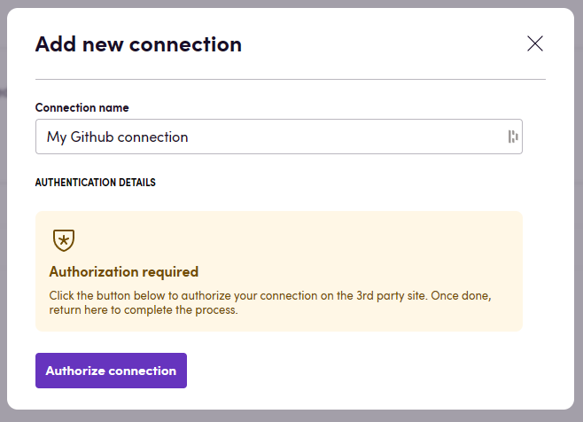
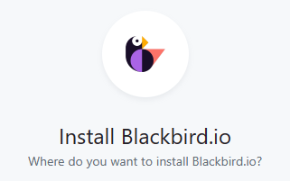
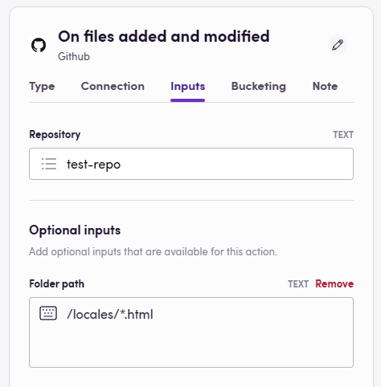
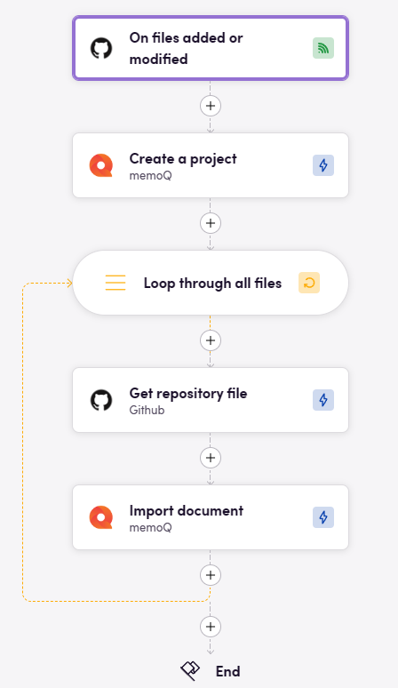

# Blackbird.io Github

Blackbird is the new automation backbone for the language technology industry. Blackbird provides enterprise-scale automation and orchestration with a simple no-code/low-code platform. Blackbird enables ambitious organizations to identify, vet and automate as many processes as possible. Not just localization workflows, but any business and IT process. This repository represents an application that is deployable on Blackbird and usable inside the workflow editor.

## Introduction

<!-- begin docs -->

GitHub, is a developer platform that allows developers to create, store, and manage their code. This Github app focusses on connecting Github events and file actions into the Blackbird ecosystem.

## Before setting up

Before you can connect you need to make sure that:

- You have a Github account.
- You have owner permissions on the repository you want to automate on.

## Connecting

1. Navigate to apps and search for Github. If you cannot find Github then click _Add App_ in the top right corner, select Github and add the app to your Blackbird environment.
2. Click _Add Connection_.
3. Name your connection for future reference e.g. 'My Github connection'.
4. Click _Authorize connection_.
5. Follow the instructions that Github gives you, authorizing Blackbird.io to act on your behalf.
6. When you return to Blackbird, confirm that the connection has appeared and the status is _Connected_.

## Setting up events

In order to respond to events happening in Github, you need to also install our app on your repository.

1. Got to the [Blackbird app page](https://github.com/apps/blackbird-io) on Github.
2. Click _Configure_
3. Select the organization where you want to install Blackbird.
4. Select either _All repositories_ or _Only select repositories_ if you want to limit the repositories Blackbird has access to.

## Actions

### Repositories

- **List repositories**
- **Create new repository**
- **Get repository**
- **Get repository issues**
- **List all repository content**
- **List repository folder content**
- **File exists** 

### Branches

- **List branches**
- **Get branch**
- **Merge branch**

### Commits

- **List commits**
- **Get commit**

### Pull requests

- **Create pull request**
- **List pull requests**
- **List pull request commits**
- **Get pull request**
- **Get repository pull requests**
- **Is pull request merged**
- **List pull request files**
- **Merge pull request**

### Files

- **Get repository file**
- **Get all files in folder**
- **Get files by filepaths**
- **Delete file**
- **Push file**
- **Update file**

### Users

- **Get my user data**
- **Get user**
- **Get user by username**

### Utility

- **Is file in folder**

## Events

### Pulls

= **On pull request action** occurs when there is activity on a pull request. See [this page](https://docs.github.com/en/webhooks/webhook-events-and-payloads#pull_request) for more info.

### Pushes

- **On commit pushed** occurs when there is a push to a repository branch. This includes when a commit is pushed, when a commit tag is pushed, when a branch is deleted, when a tag is deleted, or when a repository is created from a template.
- **On files added** is triggered when new commits have new files. It returns the paths to all added files.
- **On files modified** is triggered when new commits modify files. It returns paths to all modified files.
- **On files added or modified** is triggered when new commits add new files or modify files. It returns paths to all these files.
- **On files removed** is triggered when new commits remove files. It returns paths to all deleted files.

For the file specific events, a path parameter can be specified in order to narrow down the event to only files in specific folders or files that have certain extensions. Use the forward slash '/' to represent directory separator. Use '\*' to represent wildcards in file and directory names. Use '\*\*' to represent arbitrary directory depth.

For example: when you want to create an event that triggers only when .html files are modified in a folder called _locales_. Then the path of the **On files added or modified** event should be: _/locales/\*.html_

## Example

The following bird creates a new memoQ project whenever files are updated or added to a specific folder in a Github repository.

## Missing features

We have the ability to trigger on any event specified in [this list](https://docs.github.com/en/webhooks/webhook-events-and-payloads). Feel free to request these with us.

## Feedback

Do you want to use this app or do you have feedback on our implementation? Reach out to us using the [established channels](https://www.blackbird.io/) or create an issue.

<!-- end docs -->
